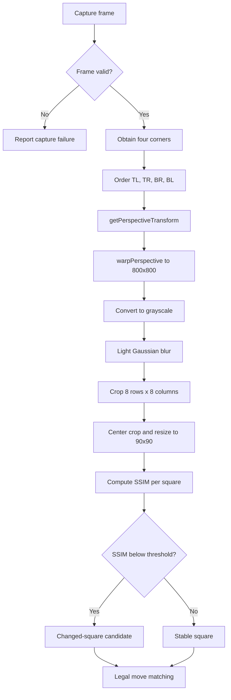
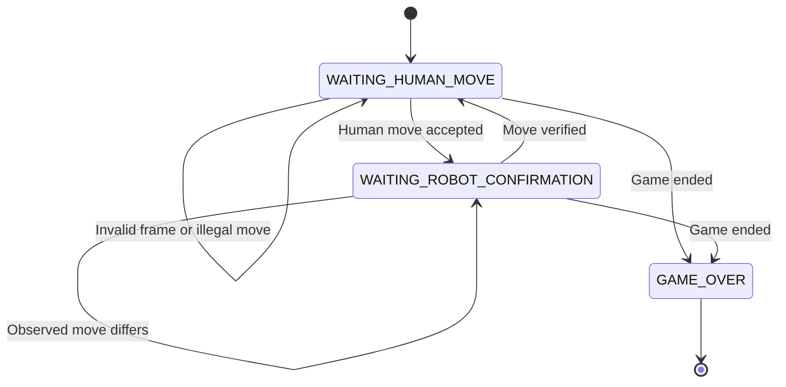

# Vision-Guided Robotic Chessboard

An experimental system that lets a human play chess against a chess engine while a 6-DOF robotic arm physically performs the engine's moves.

> **Project status:** Prototype / research demonstrator.  
> The repository documents the current implementation; it is not presented as a production-ready or consistently accurate computer-vision system.

## Concept

A phone mounted on an adjustable stand exposes a still-image HTTP endpoint through an IP Camera application. Python captures the board, obtains its four corners, rectifies the perspective, divides the board into 64 squares, and compares the current frame with the previous accepted frame. Changed squares are matched against legal moves generated by `python-chess`. Stockfish then proposes a response, which is converted into calibrated robot-arm poses and sent to an Arduino over Serial. A later camera frame verifies the robot move.

## Key features

- Works with a phone/IP camera that can provide an HTTP still image; no dedicated chess camera is required.
- Uses calibrated board corners from JSON, with an optional Roboflow corner-detection model.
- Perspective rectification with OpenCV homography.
- 8×8 segmentation mapped to `a8`–`h1`.
- SSIM-based changed-square detection.
- Legal-move-constrained interpretation using `python-chess`.
- Handling for normal moves, captures, castling, en passant, and promotion in the game/robot logic.
- UCI adapter for Stockfish, plus a fake-engine mode for experiments.
- Calibrated square poses for a 6-DOF arm.
- Gradual servo motion, turn LED, confirmation button, and visual verification.

## Main design advantage

Unlike many robotic-chess projects that require a custom mechanical arm and a dedicated camera, this system separates the chess logic from the hardware-specific calibration:

- **Camera agnostic:** any camera or phone is acceptable if it can provide a still image URL and a stable view of the board.
- **Arm agnostic:** any compatible 6-DOF arm can be used after calibrating the poses for its joints and workspace.
- **Calibration instead of custom hardware:** the board corners and 64 square poses are data files, so the same software architecture can be adapted to different physical setups.
- **Replaceable interfaces:** camera capture, engine communication, and Arduino/Serial control are isolated adapters.

This is a practical extensibility advantage, not a claim that every camera or arm is plug-and-play without calibration and protocol adaptation.

## System flow

```mermaid
flowchart LR
    A[Phone / IP Camera] -->|HTTP GET photo.jpg| B[Camera adapter]
    B --> C[Frame]
    C --> D{Board corners}
    D -->|Calibrated JSON| E[Perspective warp]
    D -->|Optional model| E
    E --> F[Grayscale / blur / 8x8 segmentation]
    F --> G[64 square images]
    G --> H[SSIM against reference]
    H --> I[Changed squares]
    I --> J[Legal move matching]
    J --> K[python-chess board]
    K --> L[Stockfish UCI]
    L --> M[Expected robot move]
    M --> N[Robot move executor]
    N --> O[Arduino Serial]
    O --> P[6-DOF arm]
    P --> Q[Confirmation button]
    Q --> B
```



## Image-processing flow



## Game-cycle flow



## Repository structure

The documented reference implementation is [`latest/`](./latest/):

```text
latest/
├── main.py                         # Entry point and game loop
├── ChangedSquares/
│   ├── changed_squares.py           # Vision pipeline
│   ├── m1_corners_extractor.py      # Board corners
│   ├── m2_warper.py                 # Perspective correction
│   ├── m3_segmenter.py              # 64-square segmentation
│   ├── m4_ssim.py                   # Square comparison
│   └── board_corners.json           # Camera calibration
├── Engine/engine.py                 # Fake/UCI Stockfish adapter
├── GameLogic/                       # Board, move matching, arm execution
├── Interfacing/                     # Camera and Arduino adapters
├── Arduino/...                      # Reference firmware
├── robot_arm_poses.json             # Square, REF, and THROW poses
└── stockfish/                       # External engine files
```

`org/` and `cv/` contain older or experimental copies. Their Arduino protocols and settings may differ from `latest`; do not mix them without review.

## Requirements

- Windows (the current implementation contains Windows-specific paths/tools).
- Python 3.10+.
- Any phone/IP camera exposing an endpoint such as `http://<camera-ip>:8080/photo.jpg`.
- Any compatible 6-DOF arm with six controllable servos, after pose calibration.
- Arduino Uno, button, LED, and the firmware compatible with `latest`.
- Stockfish when fake mode is disabled.
- Packages in [`requirements.txt`](./requirements.txt).

## Setup

```powershell
py -3 -m venv .venv
.\.venv\Scripts\Activate.ps1
python -m pip install --upgrade pip
pip install -r requirements.txt
```

Upload [`latest/Arduino/robot_arm_controller_with_button_led/robot_arm_controller_with_button_led.ino`](./latest/Arduino/robot_arm_controller_with_button_led/robot_arm_controller_with_button_led.ino), then configure the camera URL, COM port, and runtime flags in `latest/main.py`.

Store four ordered points in `latest/ChangedSquares/board_corners.json`:

```text
top-left, top-right, bottom-right, bottom-left
```

Calibrate `a8` through `h1`, plus `REF` and `THROW`, in `latest/robot_arm_poses.json`. Never commit real service keys; use [`.env.example`](./.env.example) as a template.

## Running

From `latest`:

```powershell
python main.py
```

The current code enables `use_fake=True` by default, so the default run does not represent real Stockfish play. For the real engine, set `use_fake=False` and provide a valid local Stockfish path. Disable `ARM_ENABLED` only for software-side experiments.

## Camera and corner model

The optional model referenced by the code is:

- **Model ID:** `chessboard-detection-yqcnu/3`
- **Roboflow model page:** https://universe.roboflow.com/chessboard-corner-detection-3b5bs/chessboard-detection-yqcnu
- **Version/dataset page:** https://universe.roboflow.com/chessboard-corner-detection-3b5bs/chessboard-detection-yqcnu/dataset/3

The model is an object detector for chessboard-corner annotations. The code converts the highest-confidence detections into corner points and orders them. It is an optional fallback: when `board_corners.json` exists, the calibrated points are used instead. The model's accuracy is not independently benchmarked in this repository, and the original prototype reported that fixed calibration was more reliable in practice.

The previously embedded Roboflow key was removed from the three copies of `m1_corners_extractor.py`. Treat that key as compromised and revoke/rotate it in Roboflow.

## Serial protocol

The reference firmware expects:

```text
90,45,90,45,90,35\n
LED_HUMAN\n
LED_ROBOT\n
```

It reports:

```text
BUTTON_PRESSED\n
```

The reference path uses 115200 baud and gradual servo movement. Other HTML/Arduino files in the repository may use different baud rates and commands.

## Scientific and engineering assessment

### Strengths

- The system is end-to-end: perception, legal chess state, engine, actuation, and verification.
- Legal move generation constrains noisy visual observations instead of trusting changed squares blindly.
- The robot's expected move is checked against a later visual observation.
- Hardware-specific calibration is data-driven, supporting different cameras and arms.
- The architecture is modular enough to replace the camera adapter, arm adapter, or engine adapter.

### Current limitations

- SSIM is sensitive to shadows, illumination changes, camera vibration, and hands crossing the board.
- There is no robust multi-frame temporal voting stage.
- The fake engine is enabled by default.
- Multiple historical copies and incompatible Arduino protocols remain in the tree.
- Source-level tests for vision, Serial, and failure recovery are missing.
- Safe stop and rollback for partially completed arm motions are incomplete.

## Recommended future work

1. Add temporal stabilization and multi-frame voting.
2. Normalize illumination and mask transient occlusions.
3. Reject ambiguous observations explicitly.
4. Add arm collision limits, emergency stop, and recovery/rollback.
5. Make paths and runtime configuration environment-based.
6. Create a labeled image benchmark and report precision, recall, latency, and false-move rate.
7. Keep one canonical implementation and archive historical copies.

## References

See [`docs/references.md`](./docs/references.md) and [`docs/architecture.md`](./docs/architecture.md).

## Licensing

This project combines local code with external components. Review the individual licenses before redistribution, especially Stockfish, OpenCV, `python-chess`, Roboflow assets, and the packages in `requirements.txt`.
