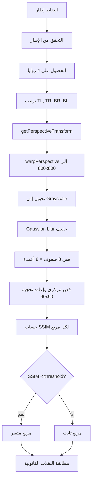
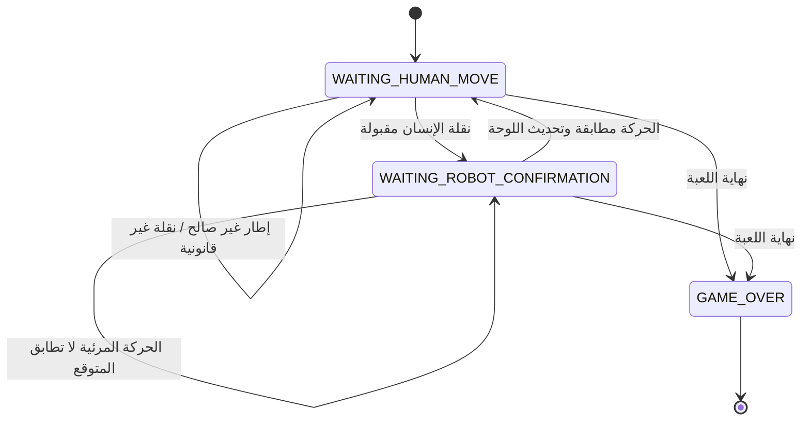

# Chess Robot: Vision-Guided Robotic Chessboard

نظام تجريبي للعب الشطرنج بين الإنسان ومحرك شطرنجي، مع قراءة النقلات بصرياً وتنفيذ نقلة المحرك بواسطة ذراع روبوتية سداسية المحاور.

> **حالة المشروع:** Prototype / Research Demonstrator  
> هذا المستودع يوثّق الحالة الحالية للكود كما هي، ولا يقدّمها كنظام إنتاجي أو كحل رؤية حاسوبية مضمون الدقة.

## الفكرة في سطر واحد

هاتف مثبت على حامل قابل للضبط يوفّر صورة عبر HTTP، ثم يعالجها تطبيق Python لاستخراج رقعة الشطرنج وتصحيح منظورها وتقسيمها إلى 64 مربعاً. تُقارن الصورة الحالية بالسابقة لاكتشاف المربعات المتغيرة، وتُطابق هذه المربعات مع النقلات القانونية في `python-chess`. بعد ذلك يقترح Stockfish نقلة مضادة، وتُحوّل النقلة إلى وضعيات معايرة للذراع وتُرسل إلى Arduino عبر Serial، ثم يتم التحقق بصرياً من نجاح التنفيذ.

## الميزات

- التقاط صورة من كاميرا هاتف/شبكة عبر `photo.jpg`.
- تثبيت زوايا الرقعة من `board_corners.json` أو محاولة كشفها بنموذج Roboflow Inference.
- تصحيح المنظور بواسطة homography إلى صورة `800×800`.
- تقسيم الصورة إلى 64 مربعاً من `a8` إلى `h1`.
- اكتشاف التغيرات باستخدام SSIM.
- تقييد تفسير النقلة بالنقلات القانونية في `python-chess`.
- دعم النقلات العادية، الأخذ، التبييت، `en passant` والترقية على مستوى منطق التنفيذ.
- واجهة UCI لمحرك Stockfish، مع نمط `fake` للتجارب.
- تنفيذ الحركة بذراع 6-DOF مع وضعيات معايرة لكل مربع.
- حركة تدريجية للمحركات، LED لتحديد الدور، وزر لتأكيد نهاية الحركة.
- التحقق من أن حركة الروبوت المرئية تطابق الحركة التي طلبها المحرك.

## مخطط النظام

```mermaid
flowchart LR
    A[هاتف + IP Camera] -->|HTTP GET photo.jpg| B[Camera Adapter]
    B --> C[Frame]
    C --> D{Board corners}
    D -->|JSON calibration| E[Perspective Warp]
    D -->|Optional model| E
    E --> F[Grayscale / Blur / 8x8 Segmentation]
    F --> G[64 square images]
    G --> H[SSIM against reference frame]
    H --> I[Changed squares]
    I --> J[Legal move matching]
    J --> K[python-chess Board]
    K --> L[Stockfish UCI]
    L --> M[Expected robot move]
    M --> N[Robot Move Executor]
    N --> O[Arduino Serial]
    O --> P[6-DOF Arm]
    P --> Q[Human/robot button]
    Q --> B
```



## تدفق معالجة الصورة



## تدفق دورة اللعب



## بنية المشروع

النسخة المرجعية الحالية هي [`latest/`](./latest/):

```text
latest/
├── main.py                         # نقطة التشغيل وحلقة اللعبة
├── ChangedSquares/
│   ├── changed_squares.py           # تجميع مراحل الرؤية
│   ├── m1_corners_extractor.py      # زوايا الرقعة
│   ├── m2_warper.py                 # تصحيح المنظور
│   ├── m3_segmenter.py              # تقسيم 64 مربعاً
│   ├── m4_ssim.py                   # مقارنة المربعات
│   └── board_corners.json           # معايرة زوايا الكاميرا
├── Engine/engine.py                 # Fake/UCI Stockfish adapter
├── GameLogic/
│   ├── game_controller.py           # حالات اللعبة
│   ├── game_observer.py             # مطابقة النقلة القانونية
│   ├── robot_move_executor.py       # تحويل النقلة إلى أفعال ذراع
│   └── board_renderer.py            # عرض حالة اللوحة
├── Interfacing/
│   ├── camera.py                    # التقاط HTTP
│   └── arduino_arm.py               # Serial + وضعيات الذراع
├── Arduino/...                       # Firmware المتوافق مع CSV/115200
├── robot_arm_poses.json             # وضعيات المربعات و REF/THROW
└── stockfish/                        # Binary/source/license files
```

توجد مجلدات [`org/`](./org/) و[`cv/`](./cv/) وملفات HTML/Arduino إضافية تبدو تاريخية أو تجريبية. لا تخلط بروتوكولاتها مع `latest` دون مراجعة؛ فبعضها يستخدم baud rate وأوامر مختلفة.

## المتطلبات

- Windows (بعض المسارات/الأدوات الحالية تعتمد على Windows).
- Python 3.10+.
- Arduino Uno مع 6 servos، زر وLED.
- هاتف أو IP Camera يوفّر:
  `http://<camera-ip>:8080/photo.jpg`
- Stockfish متوافق مع الجهاز عند تعطيل النمط الوهمي.
- المكتبات المدرجة في [`requirements.txt`](./requirements.txt).

## الإعداد

1. أنشئ بيئة افتراضية:

   ```powershell
   py -3 -m venv .venv
   .\.venv\Scripts\Activate.ps1
   python -m pip install --upgrade pip
   pip install -r requirements.txt
   ```

2. حمّل firmware الموجود في:
   [`latest/Arduino/robot_arm_controller_with_button_led/robot_arm_controller_with_button_led.ino`](./latest/Arduino/robot_arm_controller_with_button_led/robot_arm_controller_with_button_led.ino)

3. راجع `COM` وURL الكاميرا وإعدادات التشغيل في `latest/main.py`.

4. استخدم `latest/ChangedSquares/board_corners.json` لمعايرة زوايا الرقعة. يجب أن تكون النقاط مرتبة:
   `top-left, top-right, bottom-right, bottom-left`.

5. عاير وضعيات الذراع واحفظها في `latest/robot_arm_poses.json`. يجب أن تحتوي الوضعيات على مفاتيح المربعات `a8` إلى `h1` بالإضافة إلى `REF` و`THROW`.

6. قبل النشر العام، ألغِ أي API key سابق ظهر في تاريخ المشروع، واستخدم متغيرات البيئة بدلاً منه. لا تضع مفاتيح حقيقية في Git.

## التشغيل

من مجلد `latest`:

```powershell
python main.py
```

للتجارب من دون الذراع، عطّل `ARM_ENABLED` حسب الإعداد الموجود في `main.py`. في هذه الحالة تُستخدم وسائل الإدخال الاحتياطية الموفرة في التطبيق، لكن لا تعتبر المحاكاة بديلاً عن اختبار النظام الكامل.

### Stockfish

النمط الافتراضي الحالي في الكود هو `use_fake=True`، ولذلك لا يمثل أداء Stockfish الحقيقي. لتشغيل المحرك الحقيقي:

- اجعل `use_fake=False`.
- استخدم مساراً صحيحاً نسبياً للمشروع، وليس مساراً مطلقاً من جهاز المطوّر.
- تحقّق من ترخيص Stockfish وملفات النسب قبل إعادة توزيعه.

## المعايرة

### معايرة الكاميرا

1. ضع الهاتف والرقعة في الوضع النهائي.
2. استخرج إحداثيات زوايا الرقعة في صورة الكاميرا.
3. احفظ أربع نقاط في `board_corners.json`.
4. تحقق بصرياً من أن `a8` أعلى اليسار بعد التصحيح.

### معايرة الذراع

لكل مربع سجّل وضعية آمنة للالتقاط والوضع، ثم سجّل:

- `REF`: وضعية رفع الذراع/العودة.
- `THROW`: وضعية إخراج القطعة المأخوذة.

لا تعدّل الوضعيات أثناء وجود القطع أو الأشخاص في مجال الحركة. يجب اختبار حدود الحركة والاصطدامات يدوياً وبسرعة منخفضة قبل تمكين النقل التلقائي.

## البروتوكول بين Python وArduino

الـ firmware المرجعي في `latest` يستقبل:

```text
90,45,90,45,90,35\n
LED_HUMAN\n
LED_ROBOT\n
```

ويُرسل عند ضغط الزر:

```text
BUTTON_PRESSED\n
```

الإعداد الحالي يعتمد على `115200` baud وحركة تدريجية للمحركات. ملفات HTML وArduino الأخرى قد تستخدم بروتوكولاً مختلفاً؛ لا تعتبرها متوافقة تلقائياً.

## تقييم علمي وهندسي مختصر

### ما تم إنجازه جيداً

- ربط الرؤية الحاسوبية بقواعد الشطرنج القانونية بدلاً من تخمين النقلات فقط.
- دعم الحالات الخاصة للشطرنج عبر `python-chess`.
- وجود حلقة تحقق بصري من حركة الروبوت.
- فصل نسبي بين الرؤية، منطق اللعبة، المحرك، وطبقة العتاد.
- استخدام معايرة فعلية لوضعيات 64 مربعاً بدلاً من الاعتماد على inverse kinematics غير مُعاير.

### القيود الحالية

- SSIM وحده حساس للظل، تغيّر الإضاءة، اهتزاز الهاتف، وحركة اليد.
- لا توجد آلية تثبيت زمني/تصويت على عدة إطارات قبل اعتماد النقلة.
- النموذج البديل لا يبدو ضرورياً عند توفر نقاط JSON، ودقته غير موثقة داخل المشروع.
- التطبيق يستخدم مسارات وإعدادات ثابتة، ولا توجد حزمة إعداد رسمية سابقة.
- توجد نسخ متعددة من المشروع وبروتوكولات Arduino متباينة.
- لا توجد اختبارات مصدرية تغطي الرؤية، Serial، أو حالات فشل الذراع.
- النمط الوهمي للمحرك مفعّل افتراضياً في النسخة الحالية.

## التهديدات المعروفة وخطة التحسين

1. **الإضاءة والظلال:** استخدام تصحيح إضاءة/تطبيع محلي، mask للقطع، والتقاط عدة إطارات.
2. **الحركة العابرة:** اعتماد النقلة فقط بعد ثبات النتيجة لعدد إطارات متتالٍ.
3. **الالتباس:** رفض النقلة عند تعدد المرشحين بدلاً من اختيار أفضل مرشح بصمت.
4. **فشل الذراع:** إضافة state machine للإيقاف الآمن وrollback/إعادة المعايرة.
5. **المحرك:** جعل مسار Stockfish إعداداً نسبياً أو متغير بيئة مع تحقق صريح.
6. **الصيانة:** الاحتفاظ بمصدر واحد canonical ونقل التجارب إلى أرشيف واضح.
7. **القياس العلمي:** إنشاء مجموعة صور موسومة وحساب precision/recall وزمن الاستجابة.

## الاختبارات المقترحة

لا توجد suite مصدرية مكتملة في الحالة الحالية. قبل اعتبار النظام مستقراً، أضف اختبارات لـ:

- ترتيب الزوايا والتحويل إلى `a8`–`h1`.
- warp وتقسيم 64 مربعاً.
- SSIM تحت تغير الإضاءة والظلال.
- النقل العادي، الأخذ، التبييت، `en passant` والترقية.
- النقلات غير القانونية والحالات الملتبسة.
- JSON ناقص/تالف.
- timeout وفشل الكاميرا.
- فشل Stockfish وانقطاع Serial.
- عدم وجود Arduino عند نهاية اللعبة.

## المراجع

راجع [`docs/references.md`](./docs/references.md) للتفاصيل والمصادر العلمية، و[`docs/architecture.md`](./docs/architecture.md) للتوثيق التشغيلي ومخططات التدفق.

## الترخيص والمكونات الخارجية

هذا المستودع يجمع كوداً محلياً ومكونات خارجية. راجع تراخيص كل مكوّن قبل إعادة التوزيع، وخصوصاً Stockfish وOpenCV و`python-chess` والمكتبات المدرجة في `requirements.txt`. وجود ملفات Stockfish في الشجرة لا يعني أن الكود المحلي يملك حقوقها.

