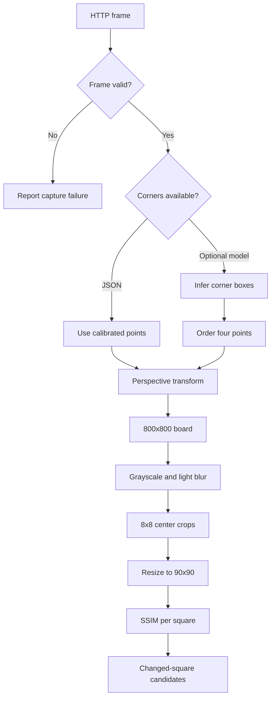
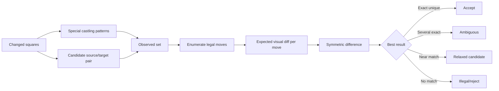
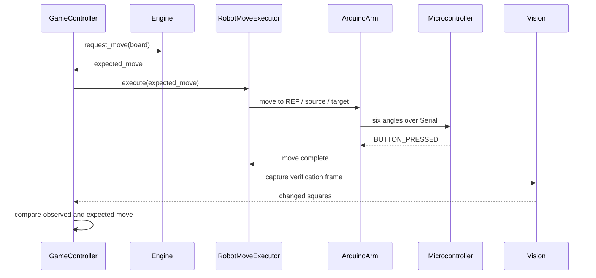

# Architecture and Flow Documentation

## Scope

This document describes the reference path in `latest/`. The `org/` and `cv/` folders and root-level HTML/Arduino files are historical or experimental copies and may use different protocols.

## Vision pipeline



Conceptually:

```text
changed(square) = SSIM(reference_square, current_square) < threshold
```

The current code uses `0.99` as an experimental threshold. It is not a universal value and must be calibrated for the selected camera, board, lighting, and distance.

## Move interpretation



The vision result does not directly mutate the board. Legal moves are generated first by `python-chess`; each move's expected changed-square set is compared with the observed set.

## Robot execution



## Camera and arm abstraction

The system is intentionally calibration-driven:

1. The camera adapter only needs a still image.
2. Four image-space board corners define the perspective transform.
3. The arm adapter maps algebraic squares to calibrated joint poses.
4. The Serial firmware translates those poses into gradual servo movement.

Consequently, a different camera or 6-DOF arm can be integrated without redesigning the chess state or engine layers. The replacement still needs calibration, mechanical safety checks, and a compatible adapter/protocol.

## Current safety boundaries

- Gradual servo movement reduces abrupt jumps but does not replace limit switches, current monitoring, or an emergency stop.
- The confirmation button prevents the next cycle from starting before a completion signal.
- Comprehensive safe-stop and rollback for a failure during a multi-step move are not implemented.
- Do not operate the arm near people, faces, or fragile objects.

## Data contracts

### `board_corners.json`

```json
{
  "points": [
    [x_top_left, y_top_left],
    [x_top_right, y_top_right],
    [x_bottom_right, y_bottom_right],
    [x_bottom_left, y_bottom_left]
  ]
}
```

### `robot_arm_poses.json`

The active adapter expects pose entries for `a8` through `h1`, plus `REF` and `THROW`. Each board pose contains five joint angles; the adapter adds the gripper angle. Do not mix this format with the older `chess-robot-positions.json` format.
