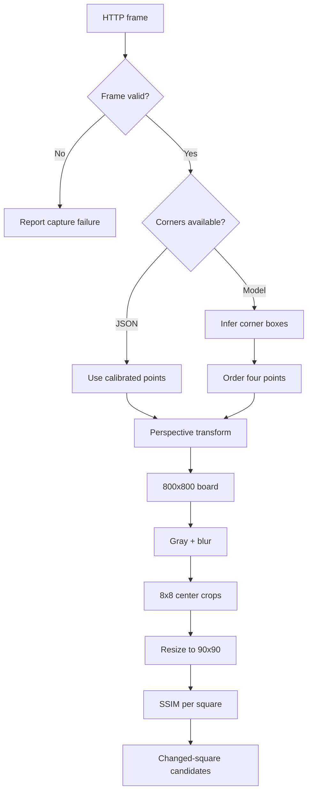
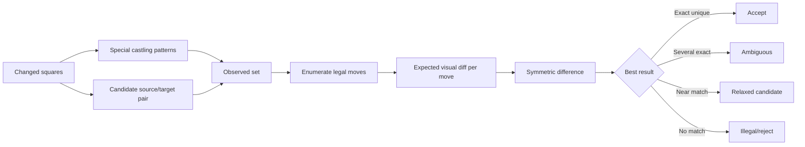
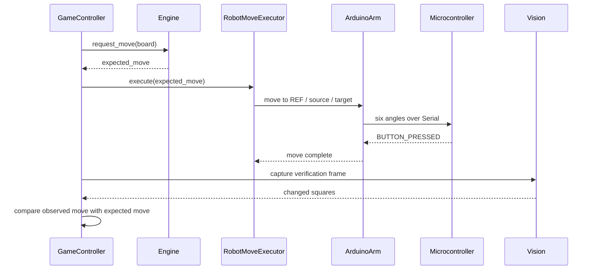

# Architecture and Flow Documentation

## 1. حدود التوثيق

هذا المستند يصف المسار المرجعي في `latest/`. المجلدان `org/` و`cv/` وملفات HTML/Arduino الجذرية تمثل تجارب أو نسخاً سابقة، وقد تختلف في البروتوكول.

## 2. مراحل الرؤية



المعادلة المفاهيمية لكل مربع:

```text
changed(square) = SSIM(reference_square, current_square) < threshold
```

في النسخة الحالية العتبة الموثقة في الكود هي `0.99`. هذه ليست قيمة عامة صالحة لكل كاميرا أو إضاءة، بل parameter تجريبي يحتاج معايرة.

## 3. تفسير النقلة



الفكرة المهمة هنا أن الرؤية لا تغيّر اللوحة مباشرة. يتم أولاً توليد النقلات القانونية من `python-chess`، ثم مقارنة أثر كل نقلة بالمربعات المرصودة.

## 4. تنفيذ حركة الروبوت



## 5. السلامة الحالية

- الحركة التدريجية للمحركات تقلل القفزات المفاجئة لكنها لا تغني عن limit switches أو مراقبة تيار.
- زر التأكيد يمنع الانتقال إلى الدورة التالية قبل إشارة المستخدم/الروبوت.
- لا توجد في النسخة الحالية آلية شاملة لإيقاف آمن أو rollback عند فشل خطوة وسطية؛ يجب اعتبار ذلك خطراً معروفاً.
- لا ينبغي تشغيل الذراع قرب اليد أو الوجه أو الأشياء القابلة للكسر.

## 6. عقود البيانات

### `board_corners.json`

```json
{
  "points": [
    [x_top_left, y_top_left],
    [x_top_right, y_top_right],
    [x_bottom_right, y_bottom_right],
    [x_bottom_left, y_bottom_left]
  ]
}
```

### `robot_arm_poses.json`

تحتوي كل وضعية على زوايا المفاصل الخمسة التي يكمّلها adapter بزاوية القبضة. المفاتيح المتوقعة هي مربعات الشطرنج مع `REF` و`THROW`. يجب اعتماد الملف الفعلي في `latest` كمصدر الحقيقة وعدم خلطه مع ملف `chess-robot-positions.json` ذي البنية القديمة.

